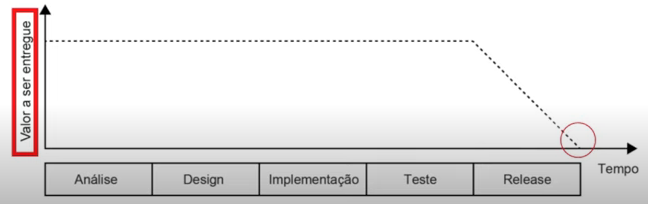
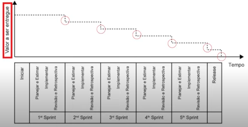

# Gerenciamento de projetos e gestão ágil

## Diferença entre processos e projetos

**Processos:**

- **O que são:** Processos são conjuntos estruturados de atividades ou ações que transformam entradas em saídas, visando a um resultado específico, mas esperado.
- **Características:** São repetitivos e têm como objetivo otimizar a eficiência e a qualidade. Eles seguem padrões e procedimentos bem definidos.

**Projetos:**

- **O que são:** Projetos são esforços temporários com início e fim definidos, realizados para criar um produto, serviço ou resultado único.
- **Características:** São únicos, têm escopo definido e geralmente envolvem recursos limitados, como tempo, orçamento e equipe.

**Principais diferenças:**

1. **Natureza:** Processos são operações contínuas e repetitivas, enquanto projetos são únicos e temporários.

2. **Duração:** Processos podem ser contínuos e não têm um fim definido, enquanto projetos têm um início e um fim claramente definidos.

3. **Escopo:** Processos têm um escopo constante, enquanto projetos têm escopo variável e podem ser adaptados ao longo do tempo.

4. **Recursos:** Processos geralmente têm recursos alocados permanentemente, enquanto projetos requerem alocar recursos específicos durante seu ciclo de vida.

5. **Objetivos:** Os objetivos de um processo são manter a eficiência e a consistência, enquanto os projetos têm como objetivo entregar um resultado único.

6. **Exemplos:** Um processo é a linha de montagem de um carro em uma fábrica. Um projeto é a construção de um novo modelo de carro.

Em resumo, processos são rotinas de negócios estabelecidas para alcançar eficiência e consistência, enquanto projetos são empreendimentos únicos criados para entregar um resultado específico. Ambos desempenham papéis cruciais nas operações de uma organização, mas têm naturezas e características diferentes.

## Gerenciamento de projetos

O gerenciamento de projetos é fundamental para planejar, executar e controlar iniciativas de forma eficaz. Duas abordagens amplamente utilizadas são o modelo tradicional em cascata (Waterfall) e o modelo ágil com Scrum. Vamos entender suas principais diferenças:

**Modelo tradicional em cascata (Waterfall):**

1. **Sequencial:** O modelo Waterfall segue uma abordagem linear e sequencial. Cada fase do projeto (planejamento, análise, design, implementação, teste, manutenção) deve ser concluída antes de passar para a próxima.

2. **Escopo Fixo:** O escopo do projeto é definido no início e raramente pode ser alterado durante o processo. Mudanças frequentes são desencorajadas.

3. **Documentação Extensa:** Requer documentação detalhada em cada fase, incluindo especificações, planos e relatórios extensos.

4. **Entrega no Final:** O cliente normalmente recebe o produto ou serviço no final do projeto, após todas as fases terem sido concluídas.

5. **Mudanças Custosas:** Mudanças no escopo ou requisitos após o início do projeto podem ser caras e complexas de implementar.

**Modelo ágil com Scrum:**

1. **Iterativo e Incremental:** O modelo Scrum é iterativo, com ciclos curtos de desenvolvimento chamados de "sprints". Cada sprint produz um incremento do produto.

2. **Flexibilidade de Escopo:** O escopo é flexível e pode ser ajustado a cada sprint. Isso permite que os clientes reavaliem prioridades e requisitos continuamente.

3. **Comunicação Constante:** A colaboração e a comunicação são enfatizadas, com reuniões diárias curtas (stand-ups) para acompanhar o progresso e resolver problemas.

4. **Entregas Frequentes:** O cliente recebe entregas parciais do produto após cada sprint, permitindo feedback constante e adaptações durante o desenvolvimento.

5. **Mudanças Bem-Vindas:** As mudanças são bem-vindas e integradas facilmente, pois o processo está preparado para acomodá-las.

**Comparação:**

- **Flexibilidade:** O Scrum é altamente flexível e pode se adaptar facilmente a mudanças, enquanto o Waterfall é menos flexível devido à natureza sequencial.

- **Comunicação:** O Scrum promove a comunicação constante entre equipe e cliente, enquanto o Waterfall pode ter comunicação mais limitada.

- **Entrega de Valor:**
  
  O Waterfall entrega o produto completo no final do projeto.

  

  O Scrum entrega valor de forma mais rápida e frequente, permitindo ao cliente usar o produto mais cedo.

  

- **Complexidade:** Projetos complexos ou inovadores muitas vezes se beneficiam do Scrum, enquanto projetos simples e bem definidos podem se adequar ao Waterfall.
